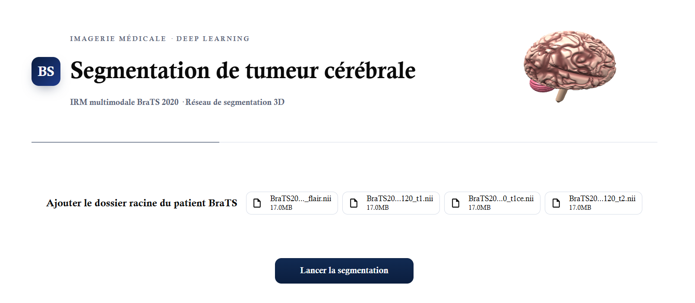
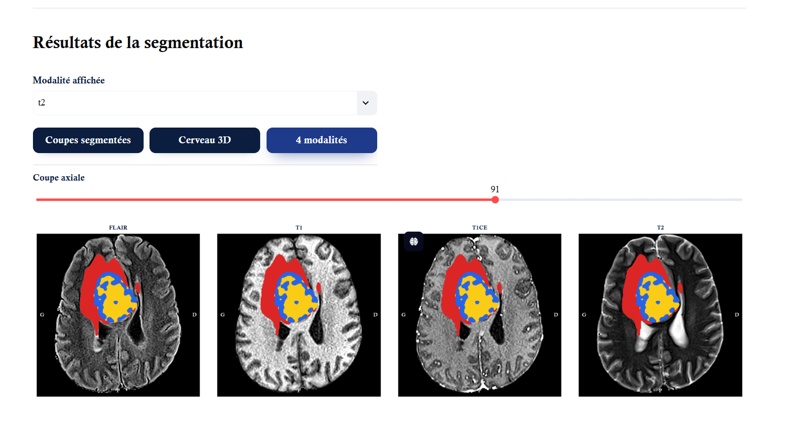
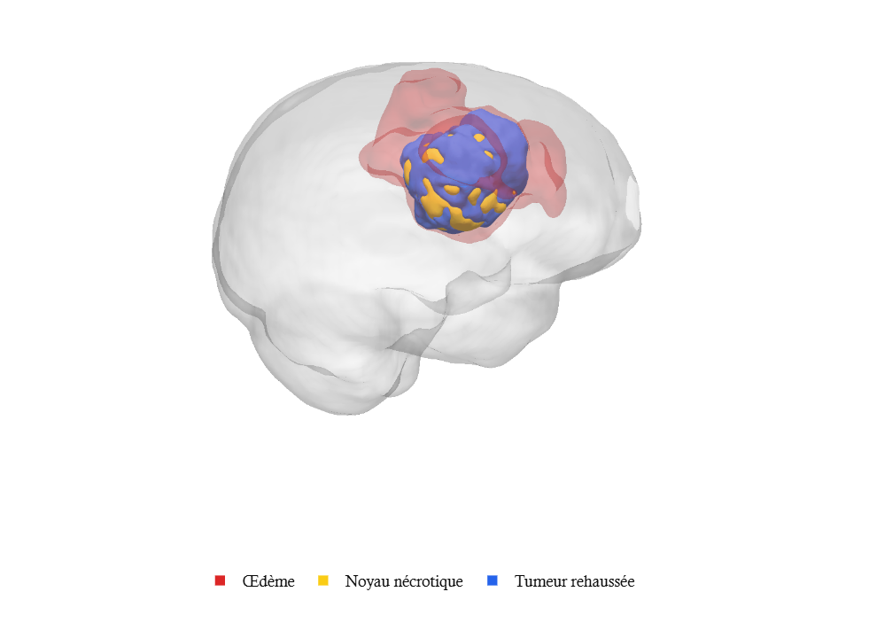
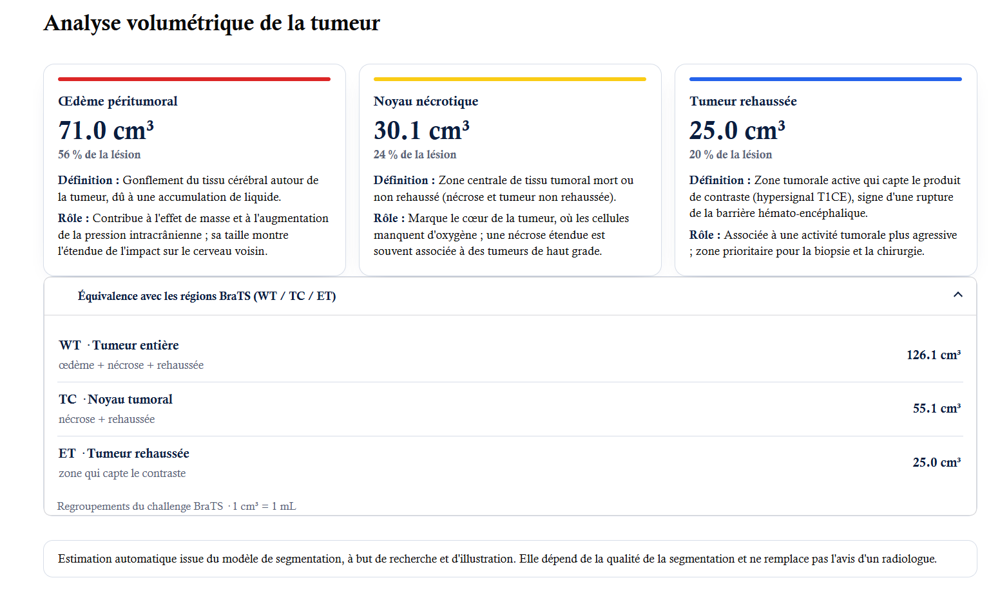

# Segmentation de tumeurs cérébrales — BraTS 2020 (MONAI / SegResNet)

Pipeline complet d'entraînement, d'inférence et d'analyse interactive (Streamlit) pour segmenter automatiquement les tumeurs cérébrales à partir des 4 modalités IRM (FLAIR, T1, T1ce, T2). Le projet produit des masques au format BraTS (labels 0, 1, 2, 4), une visualisation 2D/3D et une analyse volumétrique de la tumeur.

> **Avertissement.** Ce projet est un travail de recherche à but pédagogique. Le modèle n'a pas été validé cliniquement et ses résultats ne remplacent pas l'avis d'un radiologue.

---

## Aperçu

### 1. Chargement du patient


### 2. Comparaison des 4 modalités


### 3. Reconstruction 3D


### 4. Analyse volumétrique


---

## Sommaire

1. [Environnement et installation](#1-environnement-et-installation)
2. [Structure du projet et des données](#2-structure-du-projet-et-des-données)
3. [Entraînement](#3-entraînement-trainpy)
4. [Performances et résultats](#4-performances-et-résultats)
5. [Inférence en ligne de commande](#5-inférence-en-ligne-de-commande-inferencepy)
6. [Dashboard Streamlit](#6-dashboard-streamlit-dashboardpy)
7. [Mapping des labels BraTS](#7-mapping-des-labels-brats)
8. [Limites et perspectives](#8-limites-et-perspectives)
9. [Remarques techniques](#9-remarques-techniques)
10. [Données, licence et références](#10-données-licence-et-références)

---

## 1. Environnement et installation

L'entraînement et la validation ont été exécutés dans l'environnement suivant :

| Élément | Valeur |
|---|---|
| GPU | NVIDIA Tesla T4 (16 Go de VRAM) |
| PyTorch | 2.11.0+cu130 |
| Framework 3D | MONAI |

### Installation

```bash
python -m venv venv
source venv/bin/activate        # Windows : venv\Scripts\activate
pip install -r requirements.txt
```

Toutes les dépendances, dashboard compris (`streamlit`, `plotly`, `matplotlib`, `scipy`, `scikit-image`), sont listées dans `requirements.txt`.

---

## 2. Structure du projet et des données

### Arborescence du dépôt

```text
.
├── data_utils.py            # Chargement multimodal et conversion des classes BraTS
├── train.py                 # Entraînement SegResNet avec gestion de checkpoints
├── inference.py             # Inférence en ligne de commande (NIfTI)
├── export_utils.py          # Export du masque en NIfTI (grille de l'IRM d'origine)
├── dashboard.py             # Application Streamlit (visualisation 2D/3D et volumétrie)
├── requirements.txt         # Dépendances du projet
├── .streamlit/
│   └── config.toml          # Thème du dashboard (voir section 6)
├── assets/                  # Captures d'écran affichées dans ce README
│   ├── dashboard_input.png
│   ├── modalities_view.png
│   ├── 3d_brain.png
│   └── volumetric_analysis.png
├── runs/
│   └── best_metric_model.pth   # Meilleur modèle (sauvegardé pendant l'entraînement)
└── test/                    # Patients de test (non versionné, voir ci-dessous)
    ├── image_test/          # IRM : 4 modalités par patient
    └── mask_test/           # Segmentations de référence + masques générés par le dashboard
```

> Le dossier `runs/` du dépôt ne contient que le meilleur modèle. Lors d'un nouvel entraînement, `train.py` y écrit aussi `last_checkpoint.pth`, `split.json` et `tensorboard/` (voir section 3).

### Répartition des données

Les patients de BraTS 2020 (version disponible sur Kaggle) sont répartis en deux groupes :

| Dossier | Contenu | Utilisation |
|---|---|---|
| `donnees/` | 100 patients | Entraînement (85 patients) et validation (15 patients) |
| `test/` | Les patients restants | Jamais vus pendant l'entraînement ni la validation : sert à essayer l'application et à évaluer le modèle |

### Données d'entraînement (`donnees/`, non versionné)

```text
donnees/
├── images/      # BraTS20_Training_XXX_flair.nii, _t1.nii, _t1ce.nii, _t2.nii
└── masks/       # BraTS20_Training_XXX_seg.nii
```

Ce dossier est indiqué à `train.py` avec `--data_dir`. `data_utils.py` détecte aussi automatiquement l'organisation « un dossier par patient » (`BraTS20_Training_XXX/` contenant les 4 modalités et le fichier `_seg`), au format officiel de BraTS.

### Patients de test (`test/`, non versionné)

- `test/image_test/` : les IRM des patients de test (4 modalités par patient), à déposer dans le dashboard.
- `test/mask_test/` : les segmentations de référence de la base Kaggle (`BraTS20_Training_XXX_seg.nii`). Le dashboard y enregistre aussi une copie du masque généré, sous le nom `BraTS20_Training_XXX_seg_pred.nii.gz` ; le suffixe `_pred` permet de distinguer la prédiction de la référence.

Chaque fichier IRM pèse environ 17 Mo (près de 70 Mo par patient) : le dossier `test/` n'est donc pas versionné dans Git. Pour le recréer, téléchargez BraTS 2020 sur Kaggle, puis copiez les 4 modalités de patients absents de `donnees/` dans `image_test/` et leur fichier `_seg` dans `mask_test/`.

---

## 3. Entraînement (`train.py`)

L'entraînement repose sur l'architecture **SegResNet** de MONAI avec une fonction de perte composite **DiceCELoss**. Le réseau prédit 3 canaux superposés (approche multi-label, activation sigmoïde), puis ces canaux sont convertis en labels BraTS (voir section 7).

```bash
python train.py \
    --data_dir /chemin/vers/donnees \
    --output_dir ./runs \
    --epochs 90 \
    --batch_size 1 \
    --patch_size 128 128 128
```

### Options principales

| Option | Valeur par défaut | Rôle |
|---|---|---|
| `--epochs` | 150 | Nombre d'époques (90 pour le modèle présenté ici). |
| `--lr` | 1e-4 | Learning rate initial. |
| `--batch_size` | 1 | Nombre de patients par itération (chacun fournit 2 patchs, voir plus bas). |
| `--patch_size` | 128 128 128 | Taille des patchs 3D. |
| `--val_interval` | 5 | Validation toutes les 5 époques. |
| `--val_fraction` | 0.15 | Part du jeu de données réservée à la validation. |
| `--seed` | 42 | Graine aléatoire (séparation des données et reproductibilité). |
| `--cache_mode` | `ram` | `ram` : `CacheDataset` (`--cache_rate` pour la proportion en mémoire, 1.0 par défaut). `disk` : `PersistentDataset`, prétraitement mis en cache sur le disque. |
| `--cache_dir` | `/content/cache` | Dossier du cache disque (chemin pensé pour Google Colab, à adapter en local). |
| `--num_workers` | 2 | Nombre de processus de chargement. |
| `--resume` | — | Reprend l'entraînement depuis `last_checkpoint.pth` (modèle, optimiseur, scheduler, scaler, époque et meilleur score). |

Un checkpoint est sauvegardé à chaque époque, par écriture atomique, ce qui évite un fichier corrompu si la session est interrompue.

### Données d'entraînement

Le dossier `donnees/` contient 100 patients. Avec `--val_fraction 0.15` et la graine 42, la séparation donne **85 patients en entraînement et 15 en validation**. La liste exacte est écrite dans `split.json` (dossier de sortie, généré à chaque entraînement et non inclus dans le dépôt), ce qui permet de refaire le même découpage.

### Configuration

| Paramètre | Valeur |
|---|---|
| Architecture | SegResNet (MONAI) : `blocks_down=[1, 2, 2, 4]`, `blocks_up=[1, 1, 1]`, `init_filters=16`, `dropout_prob=0.2` |
| Entrées / sorties | 4 canaux (FLAIR, T1, T1ce, T2) → 3 canaux (TC, WT, ET) |
| Perte | `DiceCELoss` avec sigmoïde (`squared_pred=True`, `smooth_nr=smooth_dr=1e-5`) |
| Optimiseur | AdamW, learning rate 1e-4, weight decay 1e-5 |
| Scheduler | `CosineAnnealingLR` sur toute la durée de l'entraînement (`T_max = epochs`) |
| Précision | Mixte (AMP : `autocast` + `GradScaler`), activée automatiquement sur GPU CUDA |
| Patchs | 128 × 128 × 128, 2 patchs par patient, tirés à parts égales sur la tumeur et hors tumeur (`RandCropByPosNegLabeld`, `pos=1`, `neg=1`) |
| Validation | Fenêtre glissante 128³, recouvrement 50 %, seuil 0,5, Dice par région (TC, WT, ET) |

### Prétraitement

Appliqué à l'entraînement, à la validation, à l'inférence et dans le dashboard :

1. chargement des 4 modalités dans l'ordre FLAIR, T1, T1ce, T2 ;
2. orientation RAS ;
3. rééchantillonnage à 1 mm isotrope ;
4. normalisation de l'intensité par modalité, sur les voxels non nuls ;
5. recadrage sur le cerveau (`CropForegroundd`).

À l'entraînement, le masque de référence suit les mêmes étapes et est converti en 3 canaux (TC, WT, ET).

### Augmentation de données (entraînement uniquement)

| Transformation | Paramètres |
|---|---|
| Symétries (3 axes) | probabilité 0,5 chacune |
| Transformation affine aléatoire | rotation et échelle ± 0,1, probabilité 0,3 |
| Changement d'échelle d'intensité | facteur 0,1, probabilité 0,5 |
| Décalage d'intensité | décalage 0,1, probabilité 0,5 |
| Bruit gaussien | écart-type 0,01, probabilité 0,2 |

---

## 4. Performances et résultats

L'entraînement a été exécuté sur **90 époques** (environ 90 s par époque sur Tesla T4, soit près de 2 h 15 au total). La validation est effectuée toutes les 5 époques sur les 15 patients de validation.

> Les scores ci-dessous sont des **scores de validation** : le meilleur modèle est sélectionné sur ce même jeu. Ils sont donc légèrement optimistes par rapport à une évaluation sur des patients jamais vus (voir section 8).

### Synthèse

- **Meilleure performance (époque 80) : Dice moyen = 0,8486**
- **Évolution de la perte :** 0,9256 (époque 1) → 0,2608 (époque 90)

| Région tumorale | Abréviation | Meilleur Dice | Époque du pic |
|---|---|---|---|
| Tumeur entière (Whole Tumor) | WT | 0,8792 | 70 |
| Noyau tumoral (Tumor Core) | TC | 0,8716 | 50 |
| Tumeur rehaussée (Enhancing Tumor) | ET | 0,7963 | 80 |

La région ET est la plus difficile à segmenter : elle est petite, de forme irrégulière et très variable d'un patient à l'autre.

### Progression du Dice moyen en validation

| Époque | Dice moyen | Commentaire |
|---|---|---|
| 5 | 0,4137 | Initialisation et repérage de la masse globale |
| 20 | 0,7440 | Apprentissage accéléré des contours |
| 50 | 0,8447 | Stabilisation des prédictions |
| 80 | 0,8486 | Meilleur modèle, sauvegardé dans `./runs/best_metric_model.pth` |

### Courbes d'entraînement

Pendant l'entraînement, la perte et les Dice (moyen, TC, WT, ET) sont enregistrés pour TensorBoard dans `runs/tensorboard/` (dossier généré à l'entraînement, non inclus dans le dépôt) :

```bash
tensorboard --logdir ./runs/tensorboard
```

---

## 5. Inférence en ligne de commande (`inference.py`)

Pour segmenter un patient et générer un masque NIfTI :

```bash
python inference.py \
    --model_path ./runs/best_metric_model.pth \
    --flair BraTS20_Training_001_flair.nii \
    --t1    BraTS20_Training_001_t1.nii \
    --t1ce  BraTS20_Training_001_t1ce.nii \
    --t2    BraTS20_Training_001_t2.nii \
    --output BraTS20_Pred_001.nii.gz
```

Sous Windows (PowerShell), le caractère `\` de fin de ligne n'existe pas : écrivez la commande sur une seule ligne, en entourant les chemins de guillemets.

```powershell
python inference.py --model_path ./runs/best_metric_model.pth --flair "C:\chemin\BraTS20_Training_001_flair.nii" --t1 "C:\chemin\BraTS20_Training_001_t1.nii" --t1ce "C:\chemin\BraTS20_Training_001_t1ce.nii" --t2 "C:\chemin\BraTS20_Training_001_t2.nii" --output BraTS20_Pred_001.nii.gz
```

À la fin de l'exécution, le terminal indique l'espace utilisé et la forme du masque, par exemple `espace : original, shape (240, 240, 155)`.

Options facultatives :

| Option | Rôle |
|---|---|
| `--space original` (défaut) | Enregistre le masque dans la grille de l'IRM d'origine : il se superpose directement à l'IRM dans ITK-SNAP ou 3D Slicer. |
| `--space processed` | Enregistre le masque dans l'espace du modèle (RAS, 1 mm isotrope, recadré). |
| `--patch_size` | Taille des patchs de la fenêtre glissante (128 128 128 par défaut). |
| `--no_postprocess` | Désactive le filtrage des composantes connexes. |

Le script effectue les étapes suivantes :

1. prétraitement des 4 modalités (voir section 3) ;
2. inférence par fenêtre glissante (*sliding window*) de taille 128 × 128 × 128, avec 50 % de recouvrement ;
3. seuillage de la sortie sigmoïde à 0,5 ;
4. conservation de la plus grande composante connexe de chaque canal (suppression des îlots isolés) ;
5. conversion des 3 canaux vers les labels BraTS (0, 1, 2, 4) ;
6. enregistrement du masque au format NIfTI, dans l'espace choisi (`--space`).

> **Espace du fichier de sortie.** Pour replacer le masque dans la grille de l'IRM d'origine, `export_utils.py` calcule la position de chaque voxel d'origine dans le volume traité (à partir des matrices d'orientation) et prend le label du voxel le plus proche. La réorientation, le rééchantillonnage et le recadrage sont ainsi compensés. Une vérification de cohérence (même centre du cerveau dans l'espace monde) est faite avant l'export ; si elle échoue, le script l'indique et enregistre le masque dans l'espace traité plutôt que de produire un fichier décalé.

---

## 6. Dashboard Streamlit (`dashboard.py`)

Une interface web interactive permet d'analyser visuellement la segmentation d'un patient.

### Prérequis

1. Placer `dashboard.py` dans le même dossier que `data_utils.py`, `inference.py` et `export_utils.py`.
2. Vérifier que le modèle se trouve à l'emplacement `./runs/best_metric_model.pth` (chemin défini en tête de `dashboard.py`, variable `MODEL_PATH`).
3. Créer le fichier `.streamlit/config.toml` :

```toml
[theme]
base = "light"
primaryColor = "#0b1e3f"
backgroundColor = "#ffffff"
secondaryBackgroundColor = "#ffffff"
textColor = "#0a0a0a"
font = "serif"
```

### Lancement

```bash
streamlit run dashboard.py
```

### Utilisation

1. Choisir un patient du dossier `test/image_test/` (jamais vu par le modèle).
2. Déposer ses 4 fichiers NIfTI dans l'application. Le nom de chaque fichier doit se terminer par `_flair`, `_t1`, `_t1ce` ou `_t2`, suivi de `.nii` ou `.nii.gz`.
3. Cliquer sur **Lancer la segmentation**.

Le masque de référence correspondant (dossier `test/mask_test/`) n'est pas nécessaire au dashboard ; il sert à comparer la prédiction à la vérité terrain.

### Fonctionnalités

- **Coupes segmentées (2D)** : trois vues (sagittale, coronale, axiale) avec curseurs de navigation, choix de la modalité affichée, fenêtrage d'intensité adapté à chaque coupe, sur-échantillonnage et contours des régions tumorales.
- **Cerveau 3D** : reconstruction par *marching cubes* d'une enveloppe cérébrale translucide et des trois compartiments tumoraux (œdème, noyau nécrotique, tumeur rehaussée), avec légende cliquable.
- **4 modalités** : comparaison des quatre modalités sur une même coupe axiale.
- **Analyse volumétrique** : volume en cm³ (= mL) de chaque compartiment, avec sa part dans la lésion, sa définition et son rôle :

| Compartiment | Couleur | Définition | Rôle |
|---|---|---|---|
| Œdème péritumoral | Rouge | Gonflement du tissu cérébral autour de la tumeur | Contribue à l'effet de masse et à l'augmentation de la pression intracrânienne |
| Noyau nécrotique | Jaune | Tissu tumoral mort ou non rehaussé au centre de la lésion | Marque le cœur de la tumeur, où les cellules manquent d'oxygène |
| Tumeur rehaussée | Bleu | Zone active qui capte le produit de contraste (T1CE) | Associée à une activité plus agressive ; zone prioritaire pour la biopsie |

Les trois compartiments sont exclusifs : leur somme donne le volume total de la lésion. Un menu dépliable donne l'équivalence avec les régions du challenge BraTS :

- **WT** (tumeur entière) = œdème + noyau nécrotique + tumeur rehaussée ;
- **TC** (noyau tumoral) = noyau nécrotique + tumeur rehaussée ;
- **ET** (tumeur rehaussée).

Les volumes sont calculés sur des images rééchantillonnées à 1 mm isotrope : 1 voxel = 1 mm³ = 0,001 cm³.

### Export du masque

Une fois la segmentation terminée, la section **Exporter la segmentation** propose le téléchargement du masque final au format NIfTI (`<patient>_seg_pred.nii.gz`, labels BraTS 0, 1, 2, 4). Ce fichier est replacé dans la grille de l'IRM d'origine (mêmes dimensions et même orientation que le FLAIR) : il se superpose directement à l'IRM dans ITK-SNAP ou 3D Slicer.

Au clic sur le bouton, le fichier est téléchargé par le navigateur **et** une copie est enregistrée dans `test/mask_test/` (à côté de `dashboard.py`), où se trouve déjà la segmentation de référence du patient : les deux fichiers se comparent facilement (suffixes `_seg` et `_seg_pred`). Le dossier est créé s'il n'existe pas ; pour en changer, modifiez la variable `MASK_SAVE_DIR` en tête de `dashboard.py`.

> L'enregistrement dans `test/mask_test/` est prévu pour une utilisation en local : le fichier est écrit sur la machine qui exécute `streamlit run`.

Si l'alignement avec l'IRM d'origine ne peut pas être vérifié, le bouton n'est pas proposé et un message l'explique. Le masque dans l'espace traité (recadré sur le cerveau) reste disponible en ligne de commande avec `inference.py --space processed`, pour un usage technique ; il ne se superpose pas à l'IRM d'origine.

---

## 7. Mapping des labels BraTS

Le réseau prédit 3 canaux superposés (TC, WT, ET), ensuite convertis vers les étiquettes standards de BraTS.

| Label BraTS | Signification | Canaux du modèle | Couleur dans le dashboard |
|---|---|---|---|
| 0 | Tissu sain / fond | — | — |
| 1 | Noyau nécrotique et tumeur non rehaussée | TC = 1 et ET = 0 | Jaune (`#facc15`) |
| 2 | Œdème péritumoral | WT = 1 et TC = 0 | Rouge (`#dc2626`) |
| 4 | Tumeur rehaussée (T1CE) | ET = 1 | Bleu (`#2563eb`) |

Ordre des canaux de sortie : **TC, WT, ET**. Les modalités d'entrée suivent l'ordre FLAIR, T1, T1ce, T2 (défini par `MODALITIES` dans `data_utils.py`).

---

## 8. Limites et perspectives

### Limites

- **Jeu d'entraînement restreint** : seuls 100 patients (dont 15 pour la validation) ont été utilisés, alors que BraTS 2020 en compte 369 pour l'entraînement. Les performances seraient probablement meilleures avec l'ensemble des données.
- **Évaluation optimiste et bruitée** : le modèle est sélectionné et évalué sur les mêmes 15 patients de validation, ce qui donne une estimation peu robuste. Les patients du dossier `test/` n'ont jamais été vus et permettent une évaluation indépendante, qui n'est pas encore reportée dans ce document.
- **Domaine restreint** : entraînement sur des gliomes adultes avant traitement (BraTS 2020) uniquement. Les performances ne sont pas garanties sur d'autres scanners, protocoles, pathologies ou après chirurgie.
- **Région ET** : le Dice (0,80) est nettement inférieur à celui de WT et TC (0,87 à 0,88).
- **Pas de validation clinique** : les volumes affichés sont des estimations qui dépendent de la qualité de la segmentation.
- **Espace de travail** : le modèle, le dashboard et les volumes calculés travaillent dans l'espace rééchantillonné à 1 mm et recadré. Le masque peut être exporté dans la grille d'origine, mais cet export n'a été testé que sur des volumes synthétiques et doit être vérifié visuellement sur quelques patients réels.

### Perspectives

- Évaluer le modèle sur les patients du dossier `test/` (Dice moyen ± écart-type par région, distance de Hausdorff à 95 % — HD95) en comparant aux segmentations de `mask_test/`.
- Entraîner sur l'ensemble des patients de BraTS 2020, avec une validation croisée en **5 plis** (*5-fold cross-validation*).
- Analyser les cas d'échec et tester un ensemble de modèles pour améliorer la région ET.

---

## 9. Remarques techniques

- **Avertissements MONAI (`meta_tensor.py`)** : pendant l'entraînement, des messages du type `UserWarning: Setting affine, but the applied meta contains an affine` peuvent apparaître. C'est un comportement habituel de MONAI lors des transformations spatiales qui modifient la matrice d'orientation ; cela n'affecte pas l'alignement des masques pendant l'entraînement.
- **Reprojection spatiale** : les étapes `Orientationd`, `Spacingd` et `CropForegroundd` modifient l'orientation, la résolution et la taille du volume. Pour l'export, `export_utils.py` utilise la matrice d'orientation (affine) du volume traité, suivie par MONAI à travers ces étapes, pour replacer le masque dans la grille d'origine par interpolation au plus proche voisin (labels non altérés). Cette méthode remplace l'usage d'`Invertd` de MONAI.
- **Précision et matériel** : l'entraînement et le dashboard utilisent la précision mixte (`autocast`) lorsqu'un GPU CUDA est disponible. `inference.py` s'exécute en précision standard (float32). Tous fonctionnent aussi sur CPU, beaucoup plus lentement.

---

## 10. Données, licence et références

### Données

Les données proviennent du challenge **BraTS 2020** (Brain Tumor Segmentation), dans la version disponible sur Kaggle. Elles sont soumises aux conditions d'utilisation du challenge, à consulter sur le site officiel avant toute réutilisation ou redistribution.

### Références

1. Menze B. H. et al., *The Multimodal Brain Tumor Image Segmentation Benchmark (BRATS)*, IEEE Transactions on Medical Imaging, 2015.
2. Bakas S. et al., *Advancing The Cancer Genome Atlas glioma MRI collections with expert segmentation labels and radiomic features*, Scientific Data, 2017.
3. Bakas S. et al., *Identifying the Best Machine Learning Algorithms for Brain Tumor Segmentation, Progression Assessment, and Overall Survival Prediction in the BRATS Challenge*, arXiv:1811.02629, 2018.
4. Myronenko A., *3D MRI brain tumor segmentation using autoencoder regularization*, BrainLes (MICCAI), 2018 — architecture dont SegResNet est inspiré.
5. Cardoso M. J. et al., *MONAI: An open-source framework for deep learning in healthcare*, arXiv:2211.02701, 2022.